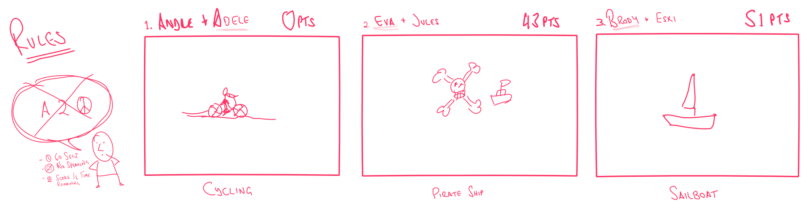
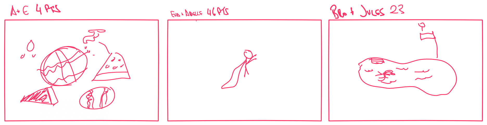

Recently, I've been running a game of Pictionary, before our designer catch-up meetings, to break the ice and get the creative juices flowing.

You only need a few things to run one yourself, with both local and remote team members alike.

# Ingredients

- Whiteboard app — [Invision Freehand](https://www.invisionapp.com/feature/freehand), there are plenty of other options like [Miro](https://realtimeboard.com/), [Witeboard](https://witeboard.com)
- Words/Phrases — [Pictionary Generator](https://peachytools.com/pictionary-generator)
- Timer — [Timer app](https://github.com/michaelvillar/timer-app)
- Screen Sharing — [Appear.in](https://appear.in/), [Google Meet](https://meet.google.com/), or [Zoom](https://zoom.us/)

## Nice to have

- iPad with Apple Pencil & corresponding Whiteboard app

# Recipe

1. Pick team members of 2 at random.
2. Share & display the whiteboard using the screen sharing/meeting app.
3. Get team member ready, with canvas centered.
4. Hit Generate on the whiteboard generator & privately show drawer the word/phrase.
5. Start the 1-minute timer.
6. Record the time remaining, when guesser correctly guesses. This is their score.
7. Repeat for each team of 2.
8. Highest score wins. 🏆

Enjoy! 👍

 

 

