JobAdder is a global recruitment platform built for staffing agency and in-house corporate recruiters. Used by over 10,000 people every day, we empower recruiters all over the world to recruit smarter and simpler.

## Problem

The previous navigation was a full width, persistent and took up 1/4 of the screen at all times. Users had always made comments and complaints about not being able to use the full height of the screen to view jobs, job ads and candidates.

## Previous design

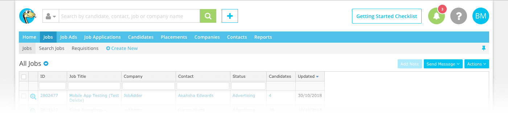

## New design

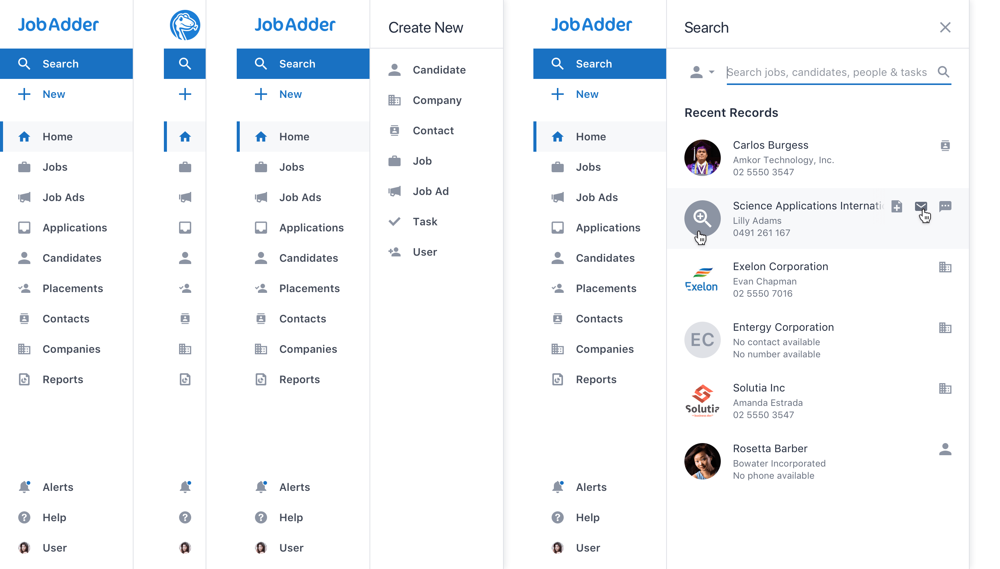

## My role

I worked with the Product Manager, [Tom Dyson](https://twitter.com/dysontom), and JobAdder CEO, [Brett Iredale](https://twitter.com/BrettIredale), to empathise with the users to understand and define the problem.

Starting with mapping the information architecture of the JobAdder suite of products with the aim to iterate and streamline the complex world of JobAdder.

I researched equally complex SaaS products to explore how others solved the same problem. Using them as inspiration to help evolve potential options.

I created wireframe upon wireframe with no fear of failure, just aiming to throw as many ideas at the wall to see what sticks.

### A small sample

  

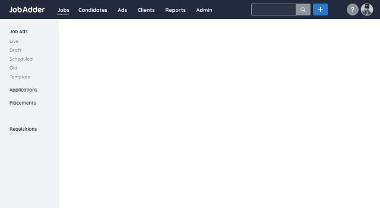

  

  

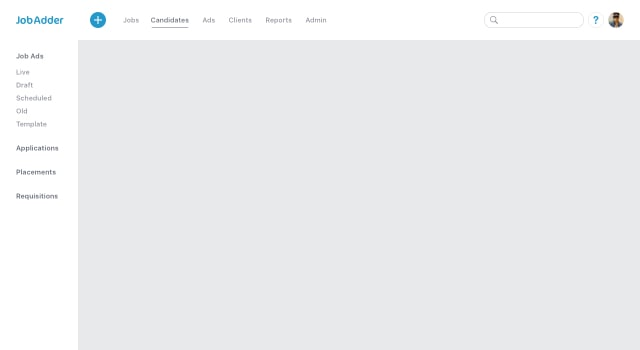

  

  

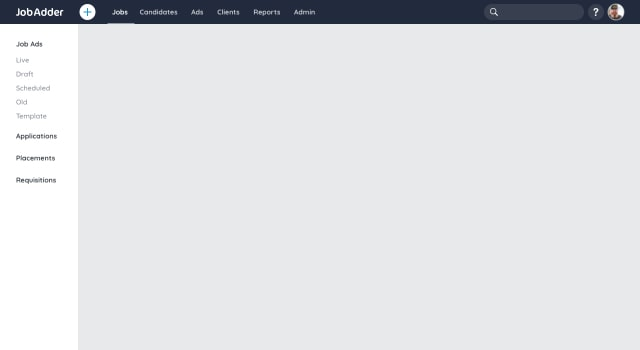

  

  

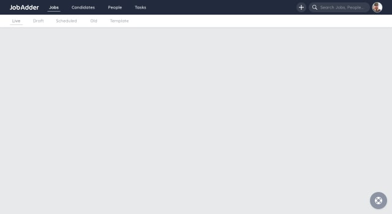

  

  

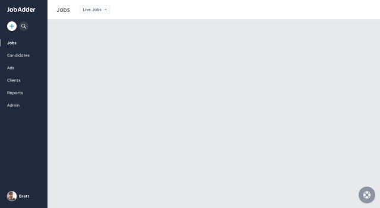

  

  

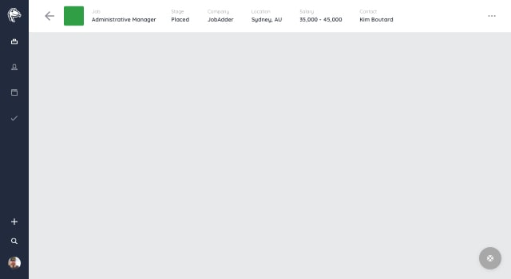

  

  

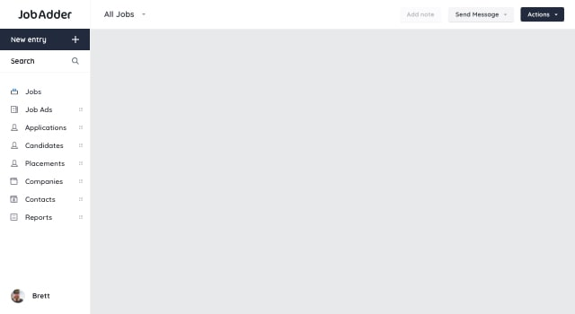

  

  

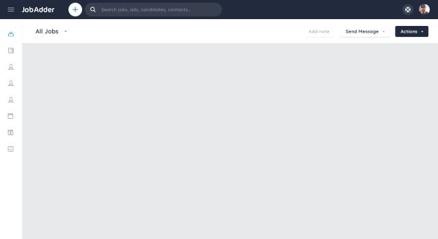

  

Once I'd found and got sign off on a solution that covered all business and user goals I moved onto high fidelity designs using the _Venom_ color palette and giving focus to accessibility.

Then moving from Sketch to code, I created a prototype to explore the interactions and animations.

  <a href="https://codepen.io/brody/full/GwKryN" target="_blank" class="bg-neutrala-90 border-neutral-800 hover:bg-neutral-800 hover:border-neutral-800 border rounded px-3 py-1 pb-3 px-3 px-2 my-4 lg:my-6 max-w-lg flex flex-wrap transition ease-linear" target="_blank">
    <h4 class="text-sm text-neutral-700 uppercase font-bold mb-0 lg:mb-0 ">Link:</h4>
    New Navigation Prototype
    <button class="fill-current rounded text-neutral-500 bg-neutral-800 py-1 px-2 flex items-center mt-1">
      <svg class="mr-1 opacity-75" height="16" viewBox="0 0 24 24" width="16" xmlns="http://www.w3.org/2000/svg"><path d="m13.8786797 8h-6.3786797c-.82842712 0-1.5-.67157288-1.5-1.5s.67157288-1.5 1.5-1.5h10c.8284271 0 1.5.67157288 1.5 1.5v10c0 .8284271-.6715729 1.5-1.5 1.5s-1.5-.6715729-1.5-1.5v-6.3786797l-8.95020426 8.9502043c-.58578644.5857864-1.53553391.5857864-2.12132035 0-.58578643-.5857864-.58578643-1.5355339 0-2.1213203z"/></svg>
      Codepen
    </button>
  </a>

Working closely with the developer, [Alex Periphanos](https://www.linkedin.com/in/alexandre-periphanos), the navigation was implemented so we were able to test it with out users.

## Learnings and iteration

The average JobAdder user isn't overly tech savvy so I chose to limit breaking mental modals where possible. Instead of restructuring the information architecture, I left that to a future version.

Another important choice was to default to the navigation being expanded. Initially having the labels visible will allow the users to easily navigate and when comfortable, collapse the nav to utilize more of the screen.

## Results

The navigation launched mid-December, after a small group of users got access to it with positive feedback. Once globally live, the feedback too was overwhelmingly positive.

<blockquote class="twitter-tweet" data-lang="en">
We&#39;ve moved (to the left) 👈🏼  Say hello to our new side navigation bar! Visit any JobAdder page with a single click and leave space for the important stuff with minimised &amp; expandable view options. <a href="https://t.co/crp84KLGqV">pic.twitter.com/crp84KLGqV</a>
&mdash; JobAdder (@JobAdder) <a href="https://twitter.com/JobAdder/status/1072964137540415488?ref_src=twsrc%5Etfw">December 12, 2018</a></blockquote>

---

# Redesign & Design System

After multiple UI design explorations, I started defining patterns, documenting & building out the Sketch component library.

## Base design elements

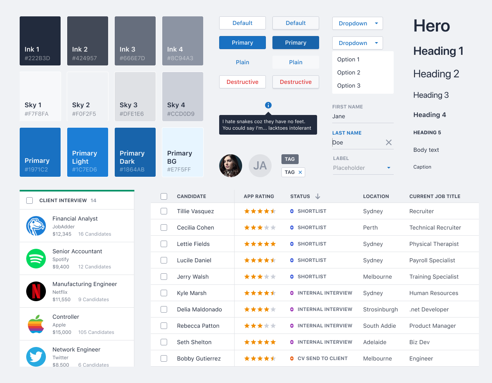

## Main table view before and after

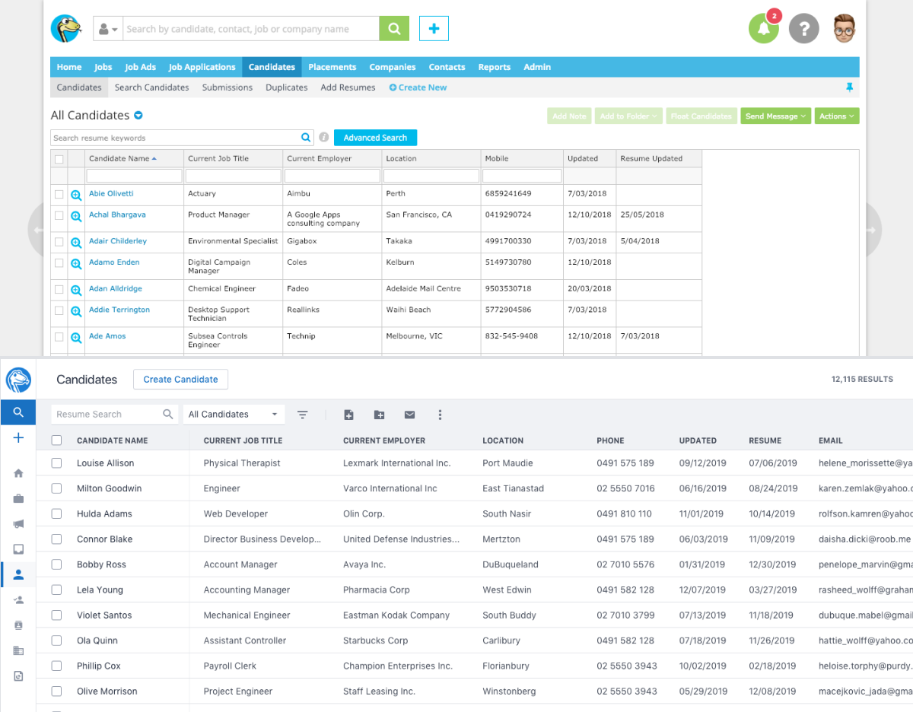

## Candidate details before & after

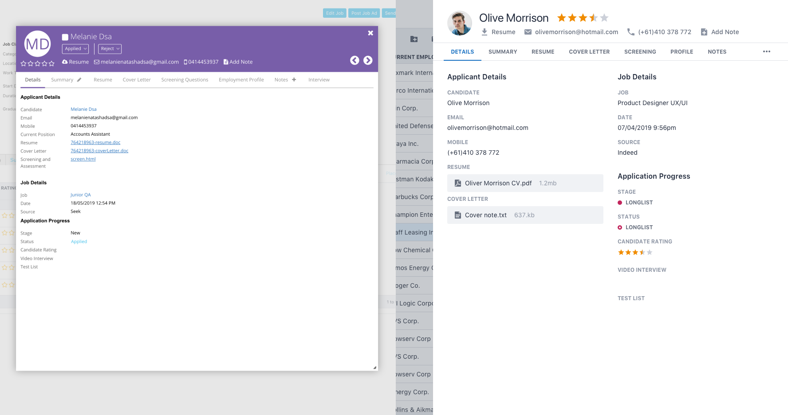
