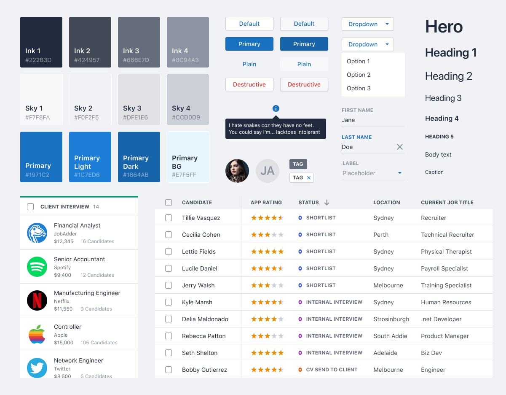
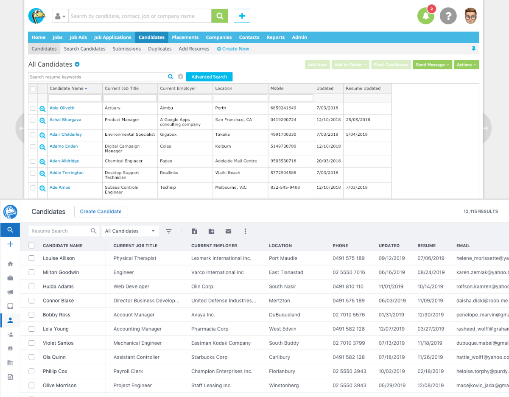
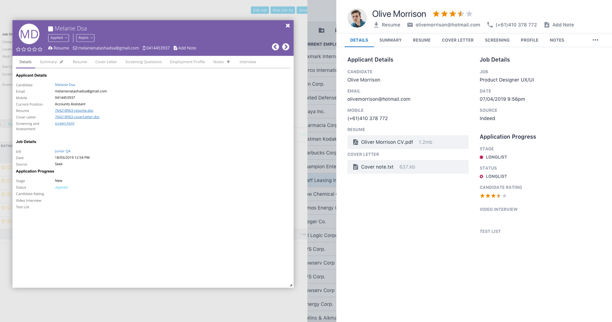

JobAdder is a global recruitment platform built for staffing agency and in-house corporate recruiters. Used by over 10,000 people every day, we empower recruiters all over the world to recruit smarter and simpler.

## Problem

JobAdder had grown over the years but felt like an app from the '90s with tiny tap targets, a cluttered inconsistent user interface, color being used in a variety of ways & many areas of improvement when it comes to accessibility best practices.

## My role

I took an inventory of the existing application to break down the priorities & find any quick impactful wins.

From there I talked with users to highlight pain-points that could be addressed with the redesign. Some of those included:

- Jumping back and forth from edit to saved states
  - I addressed this by having inline editing, from the tables through to the information-dense detail sheets
- The need to bounce between multiple candidate, job & contact detail screens, previously solved by opening multiple tabs
  - I solved for this by moving to a more light-weight "sheet" that slid in from the right & being displaying recently viewed detail sheets in the left-hand navigation's search pane

After multiple UI design explorations, I started defining patterns, documenting, building out the Sketch component library and working with the developers to componentize the design & logic.

## Base design elements

## Main table view before and after

## Candidate details before & after

